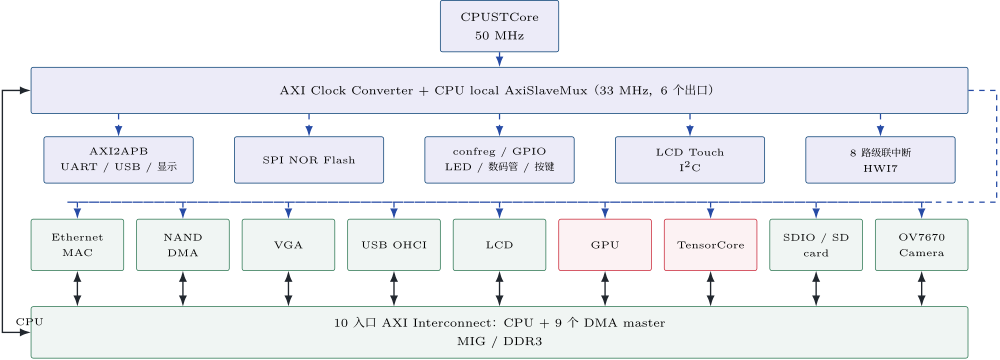
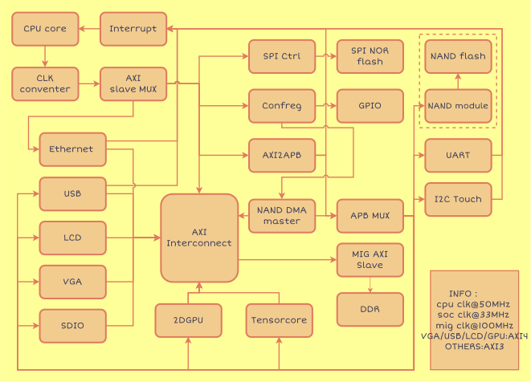
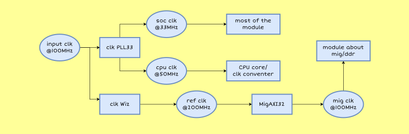

# SoC 架构与接口

本文描述当前 `xc7a200t` SoC 的源码结构和硬件接口。当前源码和对应 bitstream 已完成目标板上板验证。

## 1. 数据通路

CPUSTCore 产生 CPU AXI 请求。`AxiSlaveMux` 在 CPU local 域完成 MMIO 地址分发；未命中外设窗口的访问进入 CPU DDR path。所有需要访问 DDR 的 master 再经过固定十入口 AXI interconnect，最终由 MIG 连接 DDR3。

```text
CPUSTCore
  -> IP/myCPU/core_top.sv
  -> axi_clock_converter_0
  -> CPU local AxiSlaveMux
       |-> SPI flash
       |-> AXI2APB -> APB/UART/USB/display/NAND/camera
       |-> confreg/GPIO
       |-> Ethernet MAC registers
       |-> AXI3-to-Wishbone -> LiteSDCard control
       `-> CPU DDR path -----------------------------+
                                                     |
MAC DMA / NAND DMA / VGA / LCD / USB / SDIO / camera |
2D GPU / TensorCore ---------------------------------+
                                                     v
                                        DDR AXI interconnect
                                                     |
                                                  MigAxi32
                                                     |
                                                   DDR3
```


CPU local mux 只负责 AXI3 地址路由和响应选择，不负责协议、位宽或时钟转换。读写地址各有深度 2 的目标队列；写数据按 AW 接收顺序发送，读数据按 AR 接收顺序返回；不同出口的写响应使用轮询仲裁。

## 2. 源码入口

| 路径 | 职责 |
| --- | --- |
| `src/main/scala/chisel/CPUSTCSoc.scala` | Chisel SoC 集成顶层和固定板级 IO |
| `src/main/scala/chisel/SocFeatureConfig.scala` | 可选外设的编译期配置 |
| `src/main/scala/chisel/AxiSlaveMux.scala` | CPU local AXI3 地址分发 |
| `src/main/scala/chisel/LiteSdioController.scala` | LiteSDCard 控制和 DMA wrapper |
| `src/main/scala/chisel/WishboneAxiBridges.scala` | AXI3/Wishbone/AXI4 桥 |
| `src/main/scala/chisel/UsbOhciAxi4Apb3Utmi.scala` | OHCI UTMI+ wrapper |
| `src/main/scala/chisel/LcdCtrl.scala` | LCD APB/8080 和 DMA 连接层 |
| `src/main/scala/chisel/CameraCapture.scala` | OV7670 capture wrapper |
| `src/main/scala/verilog/soc_top.v` | Vivado top `soc_top` 的板级 wrapper |
| `src/main/scala/main/main.scala` | 根 Chisel elaboration 入口，默认使用 `SocFeatureConfig.full` |
| `IP/spinal/` | Interrupt、LCD DMA、USB 独立 SpinalHDL 工程 |
| `fpga/xc7a200t/CPUSTC-SoC/CPUSTC-SoC.srcs/` | 工程本地 BD、standalone IP 配置和 BD 子 IP `.xci`，唯一维护源 |
| `IP/xilinx_ip/` | 不属于本地 `sources_1` 文件集的其他 AMD/Xilinx IP 配置 |

`generated/xc7a200t/` 下的 SystemVerilog 是生成结果，不是手工编辑入口；生成命令见 [`build.md`](build.md)。

## 3. 功能 profile

`SocFeatureConfig` 裁剪外设实例、对应中断、DDR master 和板级输出，但所有 profile 共享同一 `SocTopIo` 和十入口 Vivado AXI interconnect。

| profile | 说明 |
| --- | --- |
| `full` | 当前全外设配置：NAND、USB、SDIO、VGA、LCD、LCD Touch、2D GPU、TensorCore、点阵和 camera |
| `sdioLiteSd` | `full` 的 LiteSDCard 对照配置，关闭 TensorCore |
| `fullWithoutSdioCameraTensorCore` | 关闭 SDIO、camera 和 TensorCore，便于分阶段验证 |
| `retirePcDebug` | 仅基础系统、退休 PC 数码管和 16 位 LED 调试 |
| `minimal` | `retirePcDebug` 的兼容名称 |

关闭模块时，其中断固定为 `0`，对应 DDR interconnect 入口保持 idle，板级输出进入安全状态。未挂载的 SDIO 窗口由 `Axi3ErrorSlave` 返回 `DECERR`；已知但关闭的 APB 页或显示子窗口立即返回 `DECERR`；未分配 APB 页保留原有等待语义。

## 4. CPU local AXI 地址

| 出口 | 地址窗口/条件 | 目标 |
| --- | --- | --- |
| `axiMasters(0)` | 未命中其余外设窗口 | CPU DDR path，接 DDR interconnect `s0` |
| `axiMasters(1)` | `0x1c000000`-`0x1c0fffff`、`0x1fe80000`-`0x1fe8ffff` | SPI flash controller |
| `axiMasters(2)` | `0x1fe00000`-`0x1fe0ffff` | `axi2apb_bridge`、`ApbMux2` 及 APB 外设 |
| `axiMasters(3)` | `0x1fd00000`-`0x1fd0ffff` | `confreg` |
| `axiMasters(4)` | `0x1ff00000`-`0x1ff0ffff` | Ethernet MAC 配置寄存器 |
| `axiMasters(5)` | `0x1fe10000`-`0x1fe1ffff` | LiteSDCard Wishbone 控制寄存器 |

SDIO 控制器只支持单拍、32 位对齐的 AXI3 MMIO；不支持的 burst 会被排空并返回 `DECERR`。CSR 从窗口偏移 `0x0800` 开始，PHY、core、读 DMA、写 DMA 和 IRQ 基址分别为 `0x1fe10800`、`0x1fe1081c`、`0x1fe10848`、`0x1fe10864` 和 `0x1fe10880`。LiteSDCard 的固定上游版本、生成方式和许可证见 [`../IP/LiteSDCard/UPSTREAM.md`](../IP/LiteSDCard/UPSTREAM.md)。

## 5. APB 地址

`axi2apb_bridge` 提供 20 位 APB 地址，`ApbMux2` 用 `apb_addr[19:13]` 精确解码，每个页为 8 KiB。CPU 地址按 APB 基址 `0x1fe00000` 换算：

| APB | 设备 | CPU 地址窗口 | 说明 |
| --- | --- | --- | --- |
| `apb0` | UART | `0x1fe00000`-`0x1fe01fff` | 8 位 legacy APB |
| `apb1` | USB OHCI | `0x1fe02000`-`0x1fe03fff` | 32 位 APB3，DMA 使用 `s4` |
| `apb2` | VGA、2D GPU、TensorCore、8x8 点阵 | `0x1fe04000`-`0x1fe05fff` | 页内偏移分别为 `0x000`、`0x100`、`0x200`、`0x300` |
| `apb3` | LCD Touch I2C | `0x1fe06000`-`0x1fe07fff` | 32 位 APB 到 8 位 Wishbone |
| `apb4` | LCD controller | `0x1fe08000`-`0x1fe09fff` | 8080 CMD/DATA、控制器和 DMA |
| `apb5` | 8 路级联中断控制器 | `0x1fe0a000`-`0x1fe0bfff` | 汇总输出到 HWI7 |
| `apb6` | NAND | `0x1fe0c000`-`0x1fe0dfff` | 32 位 legacy APB |
| `apb7` | camera capture 与 SCCB | `0x1fe0e000`-`0x1fe0ffff` | capture 前 4 KiB，SCCB 后 4 KiB |

Linux `i2c-ocores` 节点使用 camera SCCB 时需要 `reg-shift = <2>` 和 `reg-io-width = <4>`；有效寄存器地址为 `0x00`、`0x04` 至 `0x1c`，数据在低 8 位。

## 6. DDR interconnect

| 端口 | 连接目标 |
| --- | --- |
| `s0` | CPU DDR path |
| `s1` | Ethernet MAC DMA |
| `s2` | NAND DMA |
| `s3` | VGA framebuffer reader |
| `s4` | USB OHCI AXI4 DMA |
| `s5` | LCD framebuffer reader，100 MHz AXI4 read master |
| `s6` | 2D GPU framebuffer read/write |
| `s7` | TensorCore FP32 matrix DMA |
| `s8` | LiteSDCard AXI4 DMA，32 位数据、4 位 ID |
| `s9` | camera RGB565 capture AXI4 write，32 位数据、4 位 ID、固定 16 beat burst |
| `m0` | `mig_axi_32` DDR3 AXI slave |

DMA master 访问的是 AXI/DDR 可见的物理地址，不是 CPU 虚拟地址。CPUSTCore、Linux 和用户程序必须按各自软件栈的缓存一致性规则 flush/invalidate DMA 缓冲区；当前硬件不提供一致性代理。

## 7. 中断

CPU `intrpt[7:0]` 连接 LoongArch `CSR.ESTAT.IS[9:2]`，对应 HWI0-HWI7：

| 位 | 中断源 |
| --- | --- |
| HWI0 | Ethernet MAC |
| HWI1 | UART |
| HWI2 | SPI flash controller |
| HWI3 | NAND controller |
| HWI4 | NAND DMA |
| HWI5 | USB OHCI |
| HWI6 | LCD Touch I2C |
| HWI7 | 8 路 APB3 级联中断控制器 |

级联控制器输入在 `aClk` 域锁存，复位时 `MASK=0`：

| 级联位 | 中断源 |
| --- | --- |
| `[0]` | LCD Touch |
| `[1]` | LCD DMA_DONE，经 `IRQ_ENABLE[0]` 门控 |
| `[2]` | VGA framebuffer |
| `[3]` | TensorCore completion/error，经 `IRQ_ENABLE[0]` 门控 |
| `[4]` | SDIO controller |
| `[5]` | camera capture completion/error，经 `IRQ_ENABLE` 门控 |
| `[6]` | camera SCCB I2C |
| `[7]` | 预留，固定为 `0` |

级联寄存器基址为 `0x1fe0a000`：`PENDING` 位于 `0x00`，写 `1` 清 pending；`MASK` 位于 `0x04`，为 8 位读写使能。Linux 需要为 HWI7 提供分发并实现匹配该寄存器语义的 irqchip；现有 IOCSR/256-vector `extioiic` 不能直接替代它。

## 8. 时钟与复位

| 时钟/信号 | 频率或来源 | 主要使用者 |
| --- | --- | --- |
| `cpuClk` | `clk_pll_33.clk_out1`，50 MHz | CPU、Core ILA、退休 PC、AXI clock converter S 端 |
| `aClk` | `clk_pll_33.clk_out2`，33 MHz | CPU local mux、SPI/APB/confreg/MAC register、DMA 外设 |
| `io.clk` | 板级 100 MHz | VGA 和 LCD framebuffer AXI reader |
| `clk_wiz_1.clk_out1` | Vivado clock wizard | MIG `clkRef` |
| `clk_wiz_1.clk_out2` | 25 MHz | VGA pixel clock |
| `CAMERA_PCLK` | OV7670 输入，约束上限 25 MHz | DVP capture，经过 8 KiB async FIFO 到 `aClk` |
| `migAxi32.status.uiClk` | MIG UI clock | DDR/MIG AXI 侧 |

MIG `sysRst` 接外部 `resetn`。DDR/MIG AXI 侧在 `uiClk` 域等待 `!uiClkSyncRst && initCalibComplete` 后释放，再同步到 DDR、外设和 CPU 相关时钟域。33 MHz 外设中断通过两级电平同步器进入 CPU 域。修改 `cpuClk` 时必须同步更新 CPUSTCore、U-Boot 和 Linux 对计时器频率的假设。

## 9. 外设摘要

- **VGA/2D GPU**：VGA 从 DDR 基地址 `0x87e00000` 读取 RGB565 framebuffer，输出 RGB444；支持 vblank 中断和双 cursor bank。2D GPU 位于 APB 页内 `0x100`-`0x13c`，通过 `s6` 完成 framebuffer 操作。详细寄存器见 [`vga_ctrl/README.md`](vga_ctrl/README.md)。
- **TensorCore**：CPU 窗口为 `0x1fe04200`-`0x1fe042ff`，FP32 row-major 矩阵通过 `s7` DMA，级联中断输入为 `[3]`。寄存器和软件顺序见 [`../IP/TensorCore/README.md`](../IP/TensorCore/README.md)。
- **LCD**：APB/8080 逻辑运行在 33 MHz，SpinalHDL `VideoDma` 在 100 MHz，通过异步 FIFO 连接，窗口基址为 `0x1fe08000`。详见 [`lcd_ctrl/README.md`](lcd_ctrl/README.md)。
- **USB**：单端口 USB3500 OHCI Host，控制器窗口为 `0x1fe02000`，DMA 使用 `s4`，中断为 HWI5。PHY 复位和时钟复位由 FPGA 控制；Linux 不需要额外 GPIO、PHY 或 clock 属性。
- **camera**：OV7670 SCCB 使用 J13-3/4，DVP 使用 J15；capture 寄存器为 `0x1fe0e000`，SCCB 为 `0x1fe0f000`，FIFO 后由 `s9` 写 DDR，格式为 `640x480 RGB565`。当前已完成 SoC RTL，Linux V4L2、传感器初始化和板级验证尚待实现，接口细节见 [`../IP/CAMERA/README.md`](../IP/CAMERA/README.md)。
- **LiteSDCard**：控制窗口为 `0x1fe10000`，DMA 使用 `s8`。CSR、固定版本和生成校验见 [`../IP/LiteSDCard/UPSTREAM.md`](../IP/LiteSDCard/UPSTREAM.md)。

## 10. 架构图




